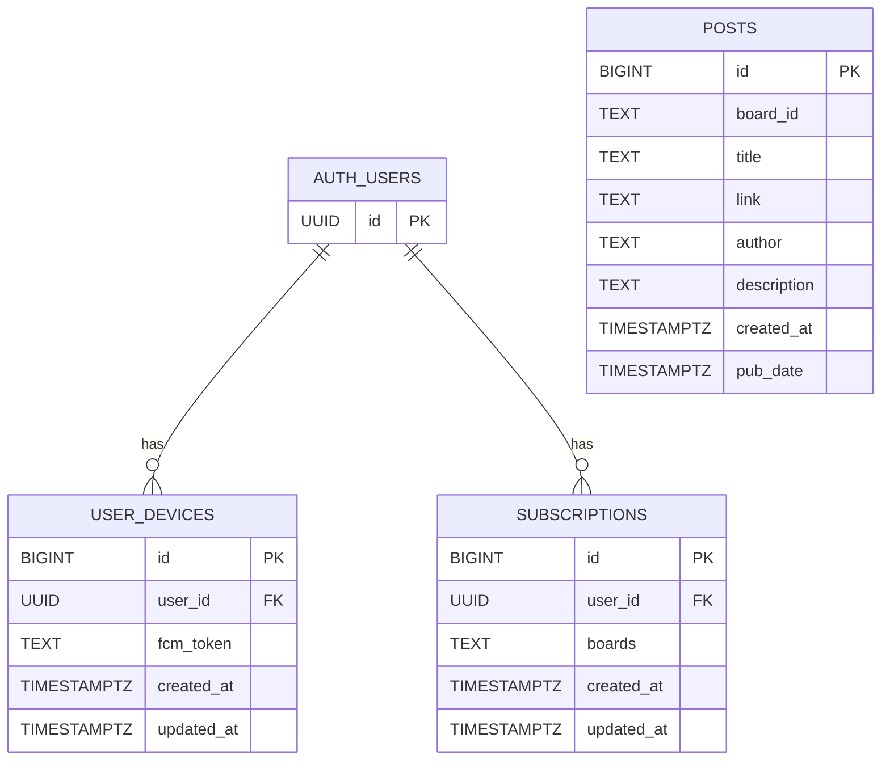

# 가천 알림이
가천대학교 공지사항 알림 서비스를 제공하는 서비스입니다.

## 홈페이지
Notion 페이지에서 설치/사용방법 및 FAQ를 제공하고 있습니다.

[바로가기](https://gachon-noti.notion.site/)

## 기술 스택
- Frontend: Flutter Web
- Backend:
  
  - Github Actions(크롤링 및 FCM 발송)
  - Supabase(Auth 및 DB)
  - Cloudflare Pages(정적 웹페이지 호스팅)

이 프로젝트는 가천대학교 재학생들의 편의를 위한 것으로,

광고 등과 같은 수익성 서비스는 일체 사용하지 않기로 결정하였기에

최대한 지속 가능한 서비스를 위하여

무료로 사용할 수 있는 범위 내에서 서비스를 진행하였습니다.

## 프로젝트 구조

```mermaid
flowchart TB
  subgraph G2["Github Actions"]
    Cron["cron"]
    GA["RSS 크롤링"]
    CP["게시물 대조"]
    Check{"새 게시물 있나요?<br/>(Supabase DB 조회)"}
    Skip["건너뛰기"]
    ActionGroup["저장 및 알림 처리"]
    Save["새 게시물 DB에 저장"]
    AC["Firebase CLI"]
  end
  subgraph G3["Firebase"]
    FCM["Firebase Cloud Messaging"]
  end
  subgraph G4["Backend"]
    BA["Supabase<br>(Database & API)"]
    AA["Supabase Auth"]
    BoardDB["Board DB"]
    SubDB["Subscription DB"]
    UsersDB["Users DB"]
  end
  subgraph G5["Frontend"]
    FE["Flutter Web(PWA)"]
    U["User"]
  end
  subgraph G6["Google"]
    GG["Google OAuth"]
  end

  Cron -- 주기적으로 트리거 --> GA
  GA --> CP
  BA --> CP
  CP --> Check
  Check -- "아니요" --> Skip
  Check -- "예" --> ActionGroup

  ActionGroup --> Save --> BA
  ActionGroup --> AC
  AC -- 푸시 알림 트리거 --> FCM
  FCM -- 푸시 알림 전송 --> FE

  FE -- 로그인 요청 --> AA
  AA -- OAuth 연동 --> GG
  AA -- 새 회원일 시 정보 저장 --> UsersDB
  GG -- 세션 전달 --> AA
  FE <-- 유저/게시물/구독 정보 요청 및 전달 --> BA
  BA --> BoardDB & SubDB & UsersDB
  U --> FE

  style G2 fill:#2C3E50,stroke:#FFF,stroke-width:1px,stroke-dasharray:2 2
  style G3 fill:#8E44AD,stroke:#FFF,stroke-width:1px,stroke-dasharray:2 2
  style G4 fill:#16A085,stroke:#FFF,stroke-width:1px,stroke-dasharray:2 2
  style G5 fill:#D35400,stroke:#FFF,stroke-width:1px,stroke-dasharray:2 2
```

## DB 구조

